# 🏨 Hotel Booking Platform (Next.js + NestJS + Turborepo)

Dự án **đặt phòng khách sạn trực tuyến** hiện đại, mạnh mẽ được xây dựng với **Next.js 15** (frontend) và **NestJS 10** (backend) trong kiến trúc **monorepo sử dụng Turborepo**. Hệ thống hỗ trợ đầy đủ quy trình từ tìm kiếm, đặt phòng, thanh toán đến quản lý khách sạn và quản trị hệ thống.

## ⚙️ Công nghệ sử dụng

| Thành phần           | Công nghệ                                           |
| -------------------- | --------------------------------------------------- |
| **Frontend**         | [Next.js 15+](https://nextjs.org/) (App Router)     |
| **Backend**          | [NestJS 10+](https://nestjs.com/)                   |
| **Monorepo**         | [Turborepo](https://turbo.build/repo)               |
| **Database**         | PostgreSQL                                          |
| **ORM**              | [Prisma](https://www.prisma.io/)                    |
| **UI Library**       | [Shadcn/ui](https://ui.shadcn.com/), Tailwind CSS   |
| **State Management** | React Query (TanStack Query)                        |
| **Form Management**  | React Hook Form, Zod                                |
| **Authentication**   | JWT (Access/Refresh Token), Passport (Google OAuth) |
| **Payment Gateway**  | **VNPAY**                                           |
| **File Storage**     | Cloudinary (Image Gallery)                          |

---

## 🚀 Cài đặt & Chạy dự án

### 1️⃣ Clone dự án

```bash
git clone https://github.com/kinyias/hotel-booking-web
cd hotel-booking-web
```

### 2️⃣ Cài đặt dependencies

```bash
npm install
```

### 3️⃣ Cài đặt biến môi trường

Copy file `.env.example` thành `.env` ở cả thư mục `apps/web` và `apps/api` (nếu có) và điền các thông số cấu hình database, JWT, VNPAY, Cloudinary...

### 4️⃣ Chạy dự án

✅ **Chạy cả frontend + backend cùng lúc:**

```bash
npm run dev
```

🔹 **Chạy riêng frontend (Next.js):**

```bash
npm run dev --filter=web
```

🔹 **Chạy riêng backend (NestJS):**

```bash
npm run dev --filter=api
```

---

## 🧠 Chức năng chính (Features)

Hệ thống được chia thành các phân hệ chức năng phong phú:

### � 1. Authentication & Users (Xác thực & Người dùng)

Hệ thống bảo mật và quản lý phiên người dùng chặt chẽ:

- **Đăng ký/Đăng nhập**: Email/Password (Argon2 hash) & **Google OAuth2**.
- **Xác minh Email**: Gửi token qua email để kích hoạt tài khoản.
- **Quản lý Token**: Cơ chế **Access Token** (ngắn hạn) & **Refresh Token** (dài hạn, xoay vòng).
- **Quản lý Session**: Theo dõi thiết bị, IP đăng nhập, thu hồi session từ xa.
- **Phân quyền (RBAC)**: Hệ thống Roles & Permissions linh hoạt (Admin, Hotel Member, User).
- **Hồ sơ cá nhân**: Cập nhật thông tin, đổi mật khẩu.

### 🏨 2. Hotel Management (Quản lý Khách sạn)

Dành cho Admin và Chủ khách sạn để vận hành kinh doanh:

- **Quản lý Khách sạn**: CRUD thông tin khách sạn, địa chỉ, mô tả, hạng sao.
- **Tiện nghi (Amenities)**: Quản lý danh sách tiện nghi khách sạn và tiện nghi phòng.
- **Chính sách (Policies)**: Thiết lập giờ nhận/trả phòng, quy định hủy phòng.
- **Hình ảnh (Gallery)**: Upload và quản lý thư viện ảnh cho khách sạn/phòng thông qua Cloudinary.
- **Thành viên (Hotel Members)**: Quản lý nhân viên/quản lý cho từng khách sạn cụ thể.

### �️ 3. Room & Inventory (Phòng & Kho phòng)

- **Loại phòng (Room Types)**: Định nghĩa các hạng phòng (Standard, Deluxe, Suite...).
- **Danh sách phòng**: Quản lý từng phòng cụ thể, trạng thái phòng.
- **Kho phòng (Inventory)**: Quản lý số lượng phòng trống theo ngày, tránh overbooking.

### � 4. Booking & Payment (Đặt phòng & Thanh toán)

Quy trình đặt phòng hoàn chỉnh cho khách hàng:

- **Tìm kiếm & Lọc**: Tìm khách sạn theo địa điểm, ngày tháng, tiện nghi, giá.
- **Quy trình đặt phòng**: Chọn phòng -> Điền thông tin -> Thanh toán.
- **Thanh toán trực tuyến**: Tích hợp cổng thanh toán **VNPAY**.
- **Quản lý Đặt phòng**:
  - Khách hàng: Xem lịch sử đặt phòng, hủy phòng (theo chính sách).
  - Admin/Hotel: Xem danh sách booking, check-in, check-out, và xử lý hoàn tiền.
- **Hoa hồng (Commissions)**: Hệ thống tính toán và xuất báo cáo hoa hồng cho nền tảng.

### 📢 5. Marketing & Content (Nội dung & Quảng bá)

- **Tin tức (News)**: Trang blog/tin tức du lịch.
- **Khuyến mãi (Promotions)**: Tạo mã giảm giá, chương trình ưu đãi cho khách sạn.
- **Banner**: Quản lý banner quảng cáo trang chủ và các trang con.
- **Đánh giá (Reviews)**: Khách hàng đánh giá và bình luận về khách sạn sau khi lưu trú.

### 🛠️ 6. System & Dashboard (Hệ thống & Quản trị)

Trang quản trị tập trung `(dashboard)`:

- **Thống kê (Dashboard)**: Báo cáo tổng quan về doanh thu, booking, người dùng mới.
- **Liên hệ (Contact)**: Quản lý form liên hệ từ khách hàng.
- **Cài đặt (Settings)**: Cấu hình hệ thống chung.

---

## 📸 Giao diện ứng dụng (Screenshots)

### 🌐 Trang Public (Giao diện người dùng)

<details>
<summary>Xem chi tiết các trang Public</summary>

|              Trang chủ               |           Danh sách khách sạn            |
| :----------------------------------: | :--------------------------------------: |
| 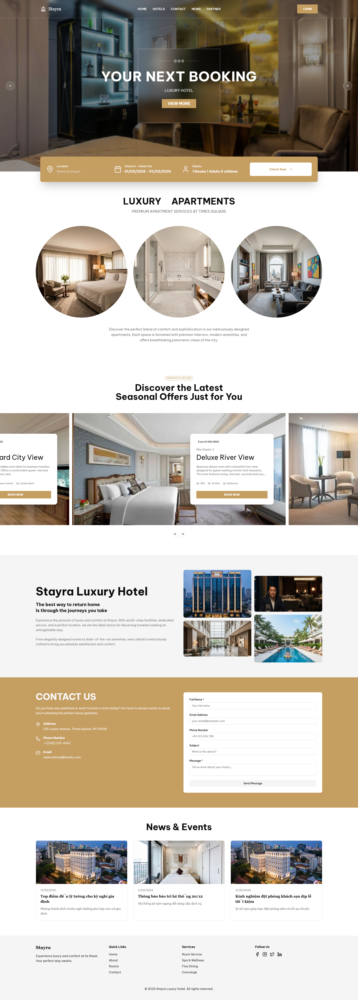 | 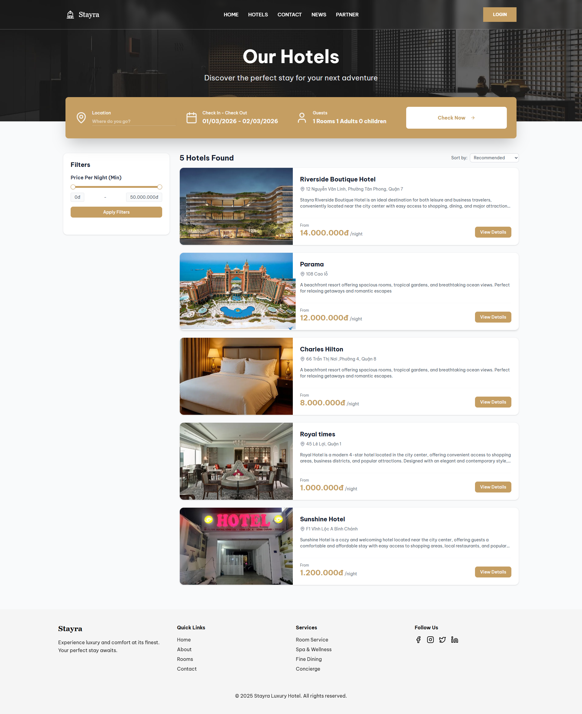 |

|                  Chi tiết khách sạn                  |            Thanh toán (Checkout)             |
| :--------------------------------------------------: | :------------------------------------------: |
| 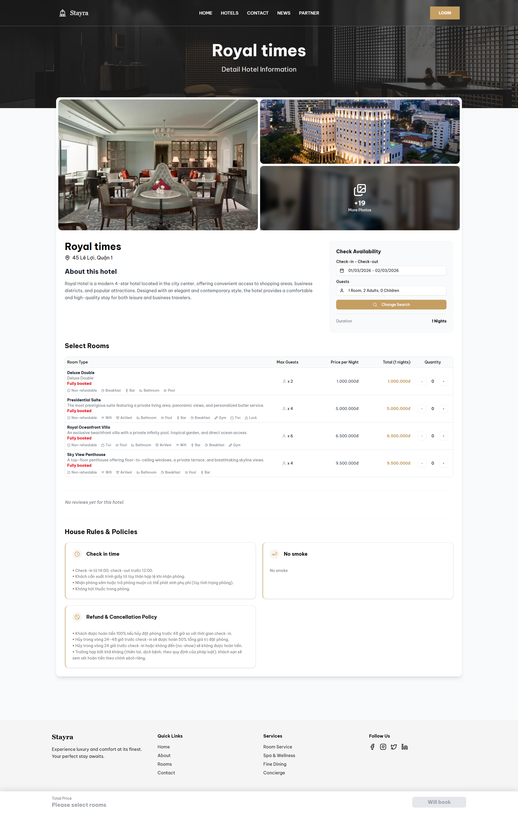 | 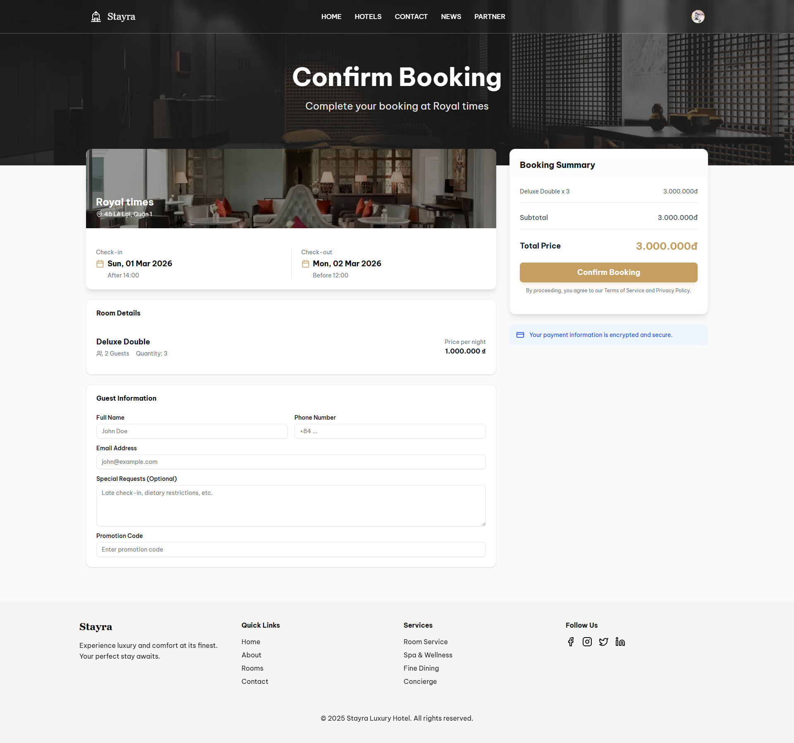 |

|            Tin tức (News)            |             Liên hệ (Contact)              |
| :----------------------------------: | :----------------------------------------: |
| 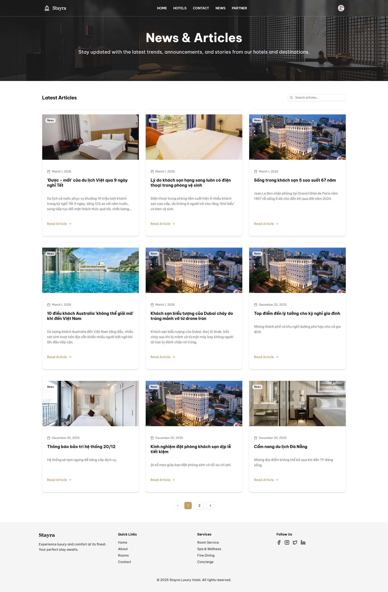 | 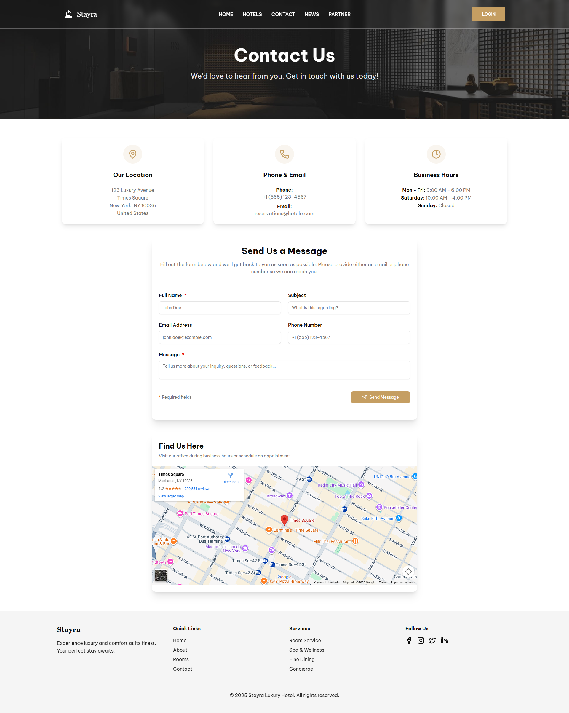 |

|             Đối tác (Partner)              |              Đơn đặt phòng của tôi               |
| :----------------------------------------: | :----------------------------------------------: |
| 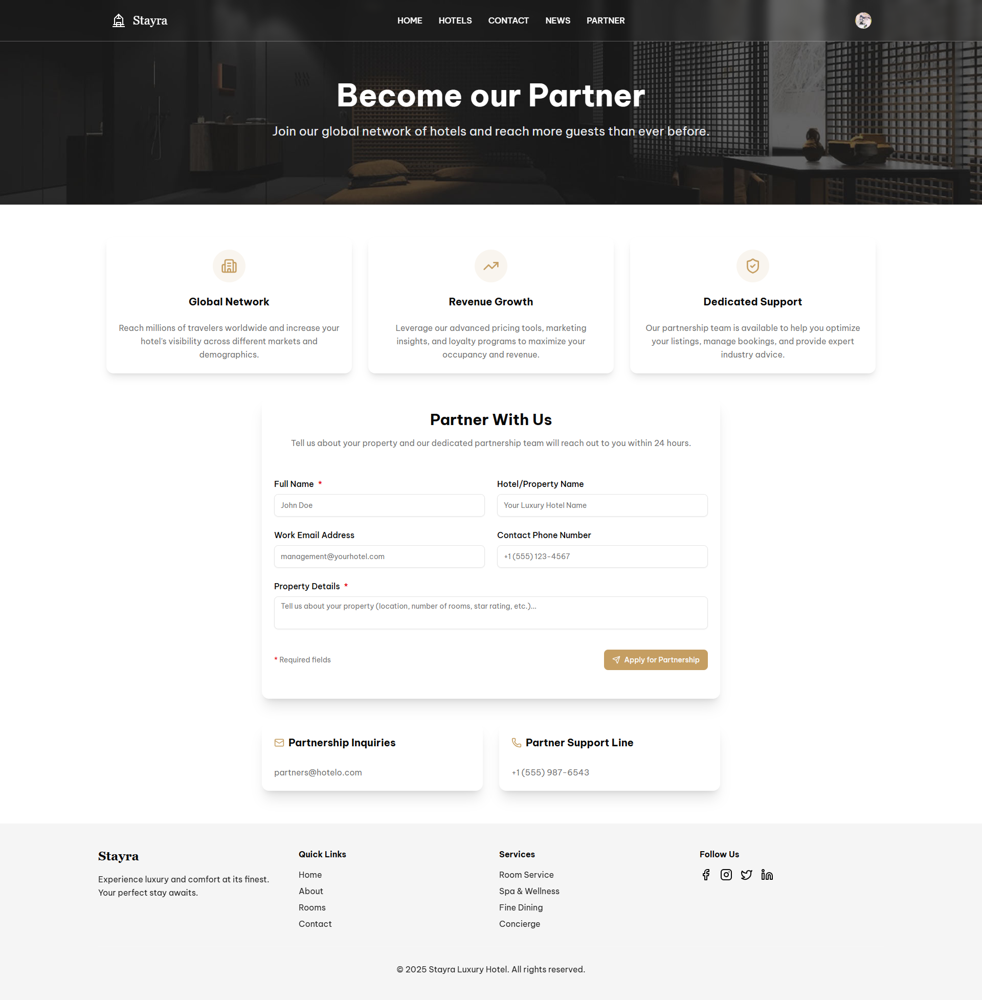 | 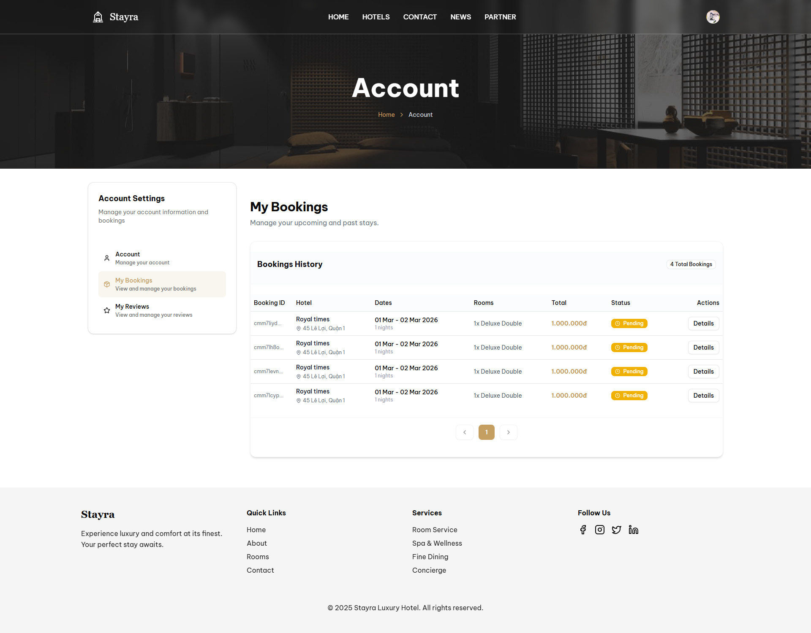 |

|                   Chi tiết đơn đặt phòng                    |     |
| :---------------------------------------------------------: | :-: |
| 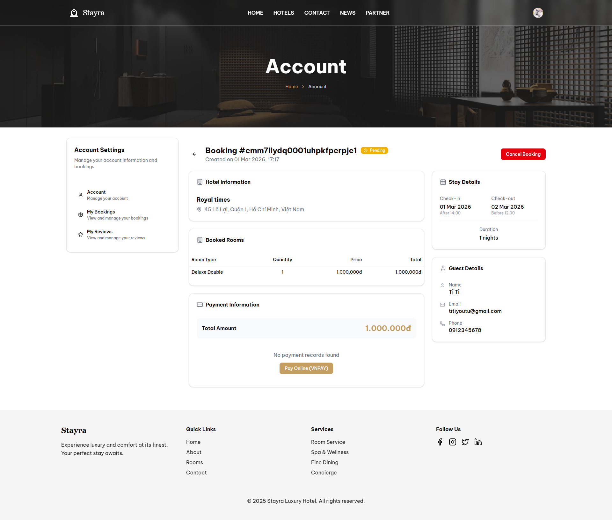 |     |

</details>

### 🛠️ Trang Quản trị (Admin/Dashboard)

<details>
<summary>Xem chi tiết các trang Dashboard</summary>

|             Tổng quan (Dashboard)              |                      Quản lý khách sạn                      |
| :--------------------------------------------: | :---------------------------------------------------------: |
| 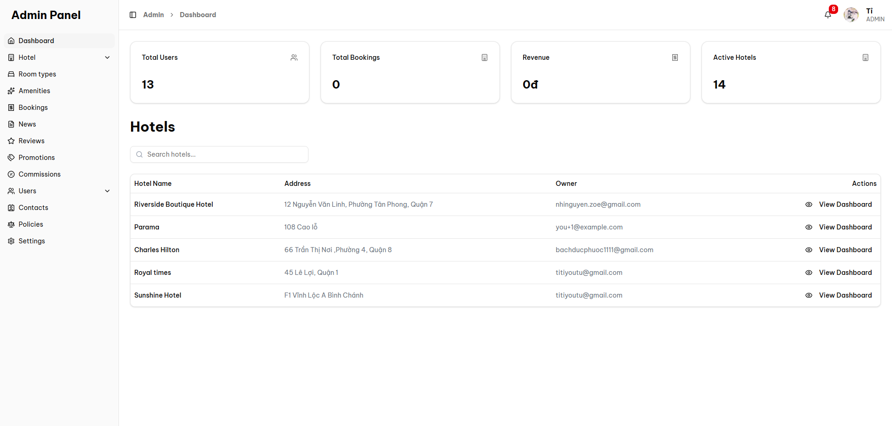 | 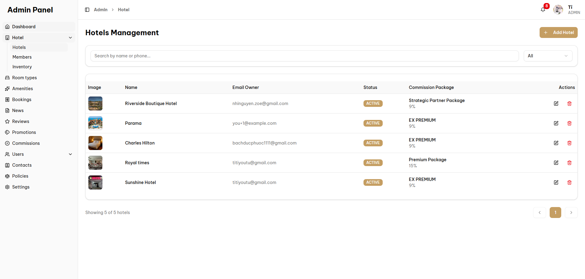 |

|         Quản lý kho phòng (Inventory)          |                Quản lý khuyến mãi                |
| :--------------------------------------------: | :----------------------------------------------: |
| 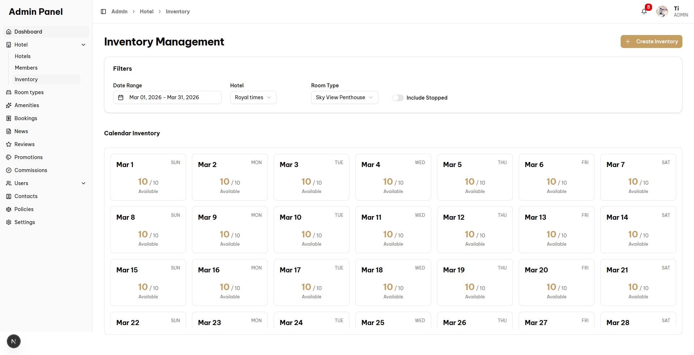 | 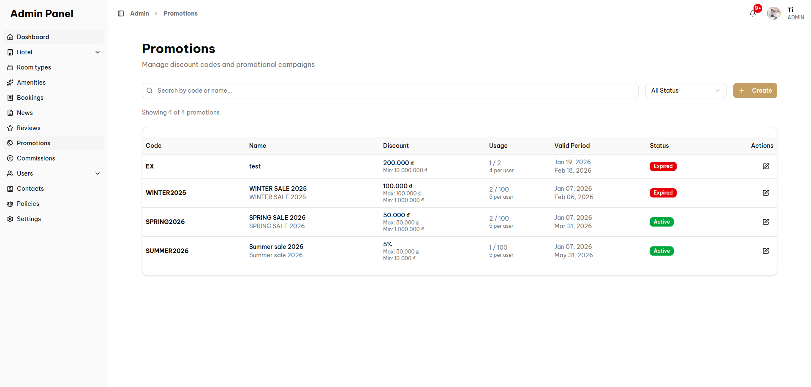 |

|                         Quản lý Banner                         |                         Quản lý nhân viên                          |
| :------------------------------------------------------------: | :----------------------------------------------------------------: |
| 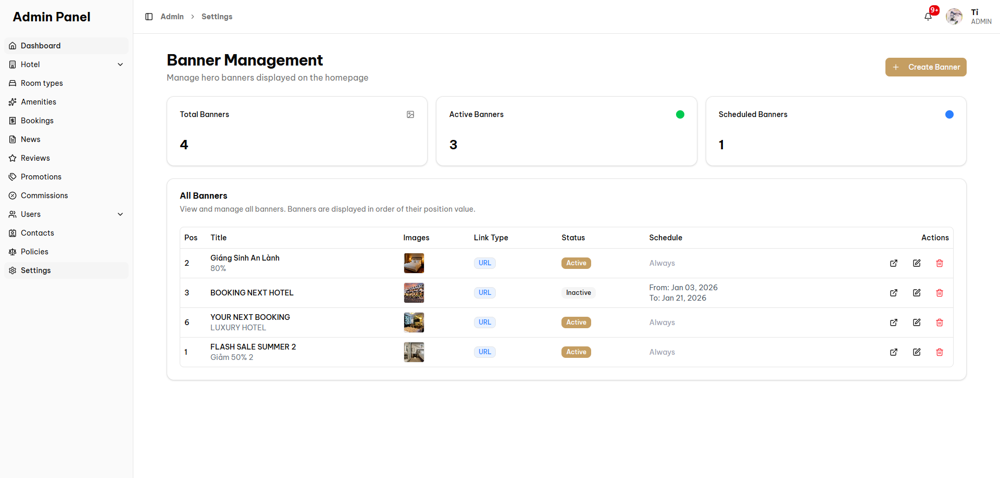 | 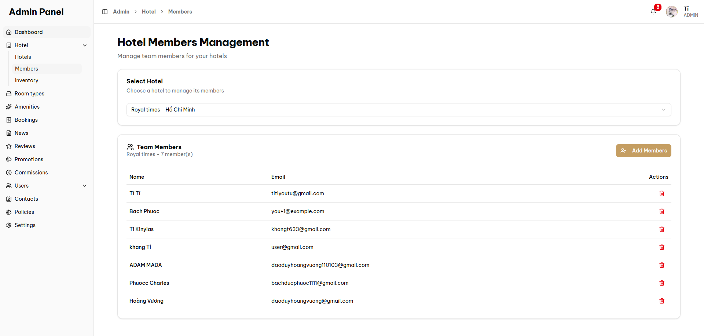 |

</details>

---

## 📂 Cấu trúc dự án (Monorepo)

- `apps/web`: Source code Frontend (Next.js).
  - `src/app/(public)`: Các trang dành cho khách vãng lai (Home, Search, Booking...).
  - `src/app/(dashboard)`: Các trang quản trị (Admin, Hotel Manager).
  - `src/features`: Chứa logic nghiệp vụ (Components, Hooks, Services) chia theo domain.
- `apps/api`: Source code Backend (NestJS).
  - `src/modules`: Các module API (Auth, Booking, Hotel, Payment...).
  - `prisma`: Schema cơ sở dữ liệu.
